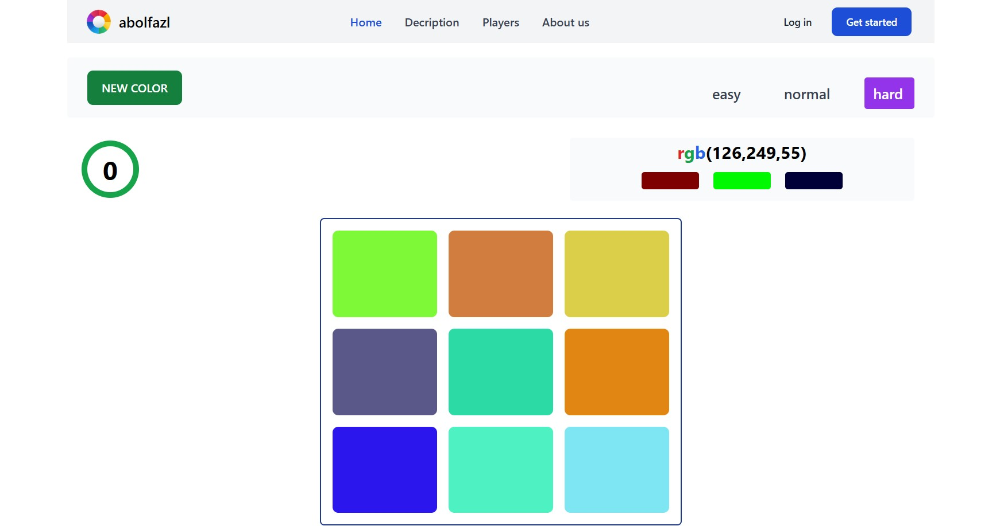

# 🎨 **Color Game Champion**

A fun and competitive color-guessing game!

 
 
# 🚀 **Overview**

Test your knowledge of colors and **RGB Codes** in this interactive and competitive game.

 - Guess the correct color from RGB codes.
 - Compete with others to earn the highest score and claim the title of champion.
 - Log in or sign up to save your progress and climb the leaderboard.

## 🌐 **Live Demo**

[Click here to play the game](https://abolfazlhatefi2004.github.io/color-game/)


## 📦 **Features**

 - **Interactive Gameplay**: Guess the correct color from multiple options.
 - **User Accounts**: Log in or sign up to track scores.
 - **Leaderboard**: Compete with others and aim to be the champion.
 - **Responsive Design**: Play seamlessly on any device.

## 🛠️ **Installation**

1.  Clone the repository:
    
 ```
git clone https://github.com/abolfazlhatefi2004/color-game.git
```

2.  Navigate to the project directory:

 ```
cd color-game
``` 
    
4.  Install dependencies:
    
  ```
npm install
``` 
    
5.  Start the project:
     
  ```
npm start
``` 
### Learn More

You can learn more in the [Create React App documentation](https://facebook.github.io/create-react-app/docs/getting-started).

To learn React, check out the [React documentation](https://reactjs.org/).

## 🎮 **Usage**

1.  Open your browser and go to [http://localhost:3000](http://localhost:3000) (or the configured URL).
2.  Log in or sign up to start playing.
3.  Select the correct color based on the RGB code to earn points.

## 🛠️ **Current Status**

-   **Version**: 2.0.02
-   **Development**: Maintenance Mode

## 🙌 **Contributing**

Contributions are welcome!

1.  Fork the repository.
2.  Create a feature branch.
3.  Submit a pull request.

